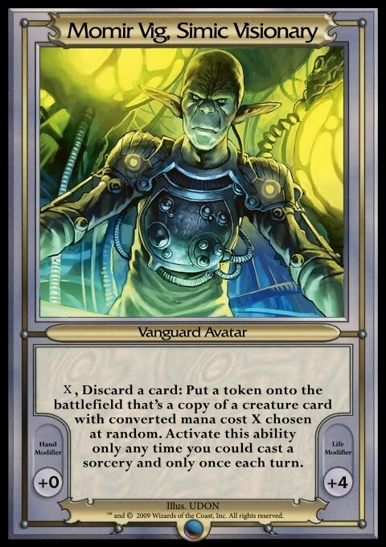

# Momir Basic Printer (MBP)

Momir Basic Printer (MBP) is a self-contained handheld device powered by an **ESP32-S3** that prints a random Magic: The Gathering creature card on a 58mm thermal receipt printer for playing the [Momir Basic](https://magic.wizards.com/en/formats/momir-basic) format.

Rotate a knob to select a CMC, press the button, and a receipt-style card prints instantly — complete with a Scryfall QR code.



## Table of Contents

- [Momir Basic Rules](#momir-basic-rules)
- [How It Works](#how-it-works)
- [Hardware](#hardware)
  - [Components](#components)
  - [Wiring](#wiring)
- [Getting Started](#getting-started)
  - [Prerequisites](#prerequisites)
  - [1. Build the Card Database](#1-build-the-card-database)
  - [2. Verify the Database](#2-verify-the-database)
  - [3. Flash the Firmware](#3-flash-the-firmware)
  - [4. Upload the Filesystem](#4-upload-the-filesystem)
- [Project Structure](#project-structure)
- [Receipt Layout](#receipt-layout)
- [Firmware Overview](#firmware-overview)
- [Disclaimer](#disclaimer)

---

## Momir Basic Rules

- **Players:** 2
- **Starting Life:** 24
- **Deck:** 60+ basic lands only

Each turn, discard a basic land to activate Momir Vig's ability and get a token copy of a random creature with that mana value from throughout Magic's history!

---

## How It Works

1. **At boot**, the ESP32 mounts a LittleFS filesystem from flash, reads the pre-built `momir.bin` creature database into PSRAM, and shows `0` on the display.
2. **Rotate** the EC11 encoder to select a CMC (0–16). The TM1637 display updates live.
3. **Press** the encoder button. The display shows `PrnT`, a random creature at that CMC is picked from PSRAM in O(1) time, and the receipt is sent to the thermal printer over UART.
4. **The receipt** prints the card name, mana cost, a centered Scryfall QR code, type line, oracle text (word-wrapped at 32 chars), and power/toughness.
5. The display returns to showing the selected CMC. Ready for the next turn.

---

## Hardware

### Components

| Component | Purpose |
|---|---|
| [ESP32-S3 DevKitC-1 (N16R8)](https://www.espressif.com/en/products/devkits/esp32-s3-devkitc-1) | Main MCU — 16MB Flash, 8MB Octal PSRAM |
| 58mm TTL Thermal Receipt Printer (e.g. [Maikrt MC206H](https://a.co/d/06qIKsng)) | Card output |
| [PAPRMA 57mm Thermal Paper](https://a.co/d/04u2Gb2j) | Receipt paper |
| [TM1637 4-Digit 7-Segment Display](https://a.co/d/0fnKGt3A) | CMC / status display |
| [EC11 Rotary Encoder with push button](https://a.co/d/0hN4SBto) | CMC selection + print trigger |

### Wiring

| Signal | ESP32-S3 GPIO | Connected To |
|---|---|---|
| Printer TX (ESP32 → Printer RX) | GPIO 17 | Printer RX |
| Printer RX (Printer TX → ESP32) | GPIO 18 | Printer TX |
| TM1637 CLK | GPIO 7 | Display CLK |
| TM1637 DIO | GPIO 8 | Display DIO |
| Encoder CLK | GPIO 4 | EC11 CLK/A |
| Encoder DT | GPIO 5 | EC11 DT/B |
| Encoder SW (button) | GPIO 6 | EC11 SW |

> [!NOTE]
> All encoder pins use internal pull-ups (`INPUT_PULLUP`). The printer serial uses `SERIAL_8N1` at 9600 baud.

---

## Getting Started

### Prerequisites

- [PlatformIO](https://platformio.org/) (CLI or VS Code extension)
- Python 3 + `curl` (for building the card database)
- A USB connection to the ESP32-S3 DevKit

### 1. Build the Card Database

Download the latest Scryfall oracle card data and pack all creature cards into the binary format used by the firmware. This step requires an internet connection and takes ~1–2 minutes.

```shell
chmod +x tools/build_momir_bin.sh
tools/build_momir_bin.sh
```

This produces `data/momir.bin` — a compact indexed binary of every paper-legal Magic creature, grouped by CMC (0–16), totalling ~4.5 MB. A pre-built copy is already committed to the repository so this step is only needed when you want to refresh the card data.

> [!TIP]
> The Scryfall bulk data is updated daily. Re-run this script periodically to include newly printed cards.

### 2. Verify the Database

Confirm the binary is well-formed and random lookups work correctly:

```shell
python3 tools/verify_bin.py
```

Expected output shows card counts per CMC and a sample of 3 random card lookups, e.g.:

```
=== 1. Header Validation ===
CMC  0:   35 cards  ...
CMC  1: 1217 cards  ...
...
Total indexed creatures: 18097

=== 2. Random O(1) Lookup Test ===
[CMC 5 | Index 742 | Offset 1849302]
Name:  Thragtusk {4}{G}
Type:  Creature — Beast
P/T:   5/3
...
```

### 3. Flash the Firmware

Build and upload the Arduino firmware to the ESP32-S3:

```shell
pio run --target upload
```

Monitor the serial output (115200 baud) to confirm boot:

```shell
pio device monitor
```

You should see:

```
[MBP] Momir Basic Printer booting...
[MBP] Printer initialized.
Database loaded to PSRAM: 4531234 bytes.
[MBP] Database ready. Entering main loop.
```

### 4. Upload the Filesystem

Flash the `data/` directory as a LittleFS image. This makes `momir.bin` available to the firmware at `/momir.bin`:

```shell
pio run --target uploadfs
```

> [!IMPORTANT]
> Do steps 3 and 4 in any order, but **both must be done** before the device will function. If the database fails to load, the display will show `Err` and the device will halt.

---

## Project Structure

```
momir-basic-printer/
├── data/
│   └── momir.bin          # Pre-built creature database (LittleFS → /momir.bin)
├── img/
│   └── momir.jpg          # Docs image
├── src/
│   ├── main.cpp           # Application entry point (setup/loop)
│   ├── CardDb.h           # LittleFS + PSRAM database loader and random lookup
│   ├── Encoder.h          # EC11 rotary encoder driver (Gray-code + debounce)
│   └── Printer.h          # Raw ESC/POS thermal printer driver
├── tools/
│   ├── build_momir_bin.sh # Download Scryfall data and build momir.bin
│   └── verify_bin.py      # Verify momir.bin structure and test random lookups
├── partitions_16mb.csv    # Flash partition table (3MB app + 13MB LittleFS)
└── platformio.ini         # PlatformIO build config
```

---

## Receipt Layout

Each printed card follows this layout:

```
Card Name               {X}{Y}{Z}
       [ QR CODE (Scryfall link) ]
        Creature — Subtype
Keyword ability.

Oracle text wrapped cleanly at
32 characters per line.

                            P / T
```

- **Name + mana cost** are space-padded to fill the 32-character line width
- **QR code** links to the card's Scryfall page (`https://scryfall.com/search?q=id%3A{uuid}`) and is centered using native ESC/POS `GS ( k` commands
- **Type line** is centered
- **Oracle text** is word-wrapped at 32 characters with blank lines between paragraphs; Unicode (em-dashes, smart quotes, bullets) is normalized to ASCII
- **Power/Toughness** is right-aligned with spaces around the slash (e.g. `5 / 5`)
- **3 blank lines** are fed after each card to clear the manual tear bar

---

## Firmware Overview

### `src/CardDb.h`

Mounts LittleFS, allocates the full `momir.bin` into 8MB Octal PSRAM via `ps_malloc`, and exposes `getRandomCard(uint8_t cmc, CardRecord& out)`. Card lookup is O(1): the binary header stores a per-CMC offset table, so selecting a random card requires exactly two seeks and one `memcpy`.

### `src/Encoder.h`

Reads the EC11 rotary encoder using a **4-state Gray-code state table** — reliable quadrature decoding with no debounce delays on the AB signal. The push-button uses a separate 50 ms timer-based debouncer. CMC is hard-clamped to `[0, 16]` via `constrain()`.

### `src/Printer.h`

Sends raw **ESC/POS** byte sequences over `HardwareSerial1`:

| Command | Purpose |
|---|---|
| `ESC @` | Initialize printer |
| `ESC E n` | Bold on/off |
| `ESC a n` | Alignment (left / center / right) |
| `GS ( k` | Native QR code (Model 2, Level M, module size 4) |
| `ESC d n` | Feed n lines |

### `src/main.cpp`

Orchestrates everything: initializes hardware in `setup()`, then in `loop()` polls the encoder, updates the TM1637 display, and on button press fetches a card from `CardDb`, builds the Scryfall URL from the raw UUID bytes, shows `PrnT` on the display, calls `Printer::printCard()`, and returns to showing the CMC.

### `platformio.ini`

Key build flags for the N16R8 variant:

```ini
board_build.arduino.memory_type = qio_opi   ; Required for 8MB Octal PSRAM
build_flags =
    -DBOARD_HAS_PSRAM
    -mfix-esp32-psram-cache-issue
board_build.partitions = partitions_16mb.csv ; 16MB flash layout
board_build.filesystem = littlefs
```

---

## Disclaimer

Neither this project nor its contributors are associated with Hasbro, Wizards of the Coast, or _Magic: The Gathering_ in any way whatsoever.

<div align="center">
  <p>Copyright &copy; 2026 Hayden Moritz</p>
</div>
